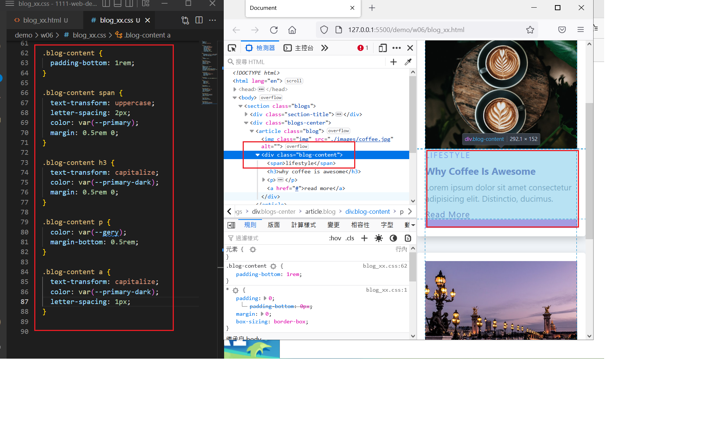
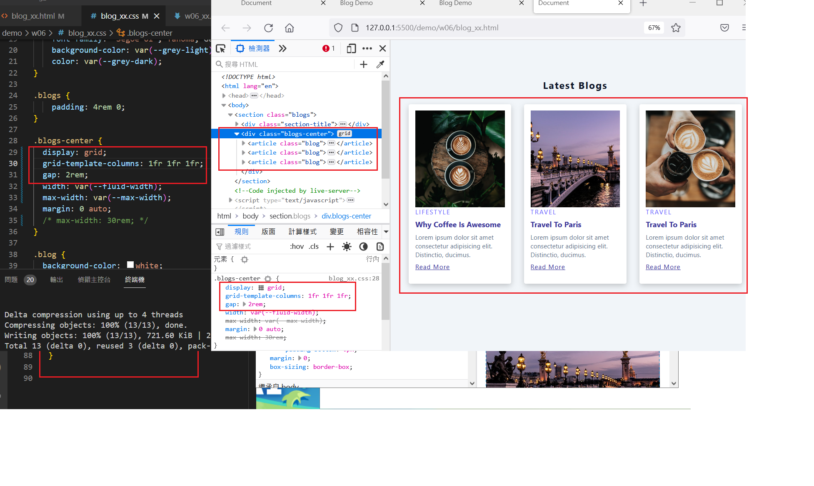
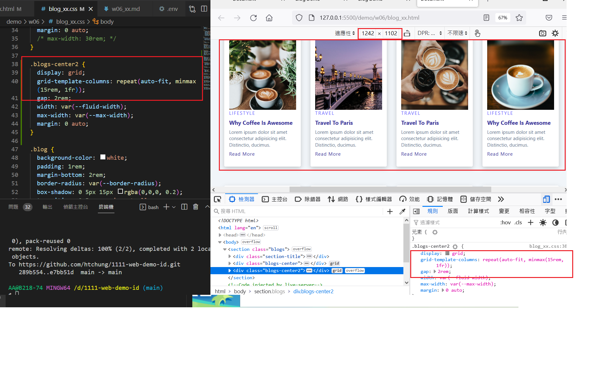

## Github & Vercel URL

[Github URL](https://github.com/htchung/1111-web-demo-id)

[Vercel URL](https://1111-web-demo-id-kd9e.vercel.app/)

### w06-P1: Add blog content with css



### w06-P2: use css grid to show 3 blogs



### w06-P3: use css grid (minmax) to show 9 blogs




### W06-logs: W6 all logs


```
$ git log --pretty=format:"%h%x09%an%x09%ad%x09%s" --after="2022-10-04"

e7bb51d htchung Wed Oct 12 14:40:28 2022 +0800  w06-P2: use css grid to show 3 blogs
289b554 htchung Wed Oct 12 14:22:47 2022 +0800  w06-P1: Add blog content with css
de7f13b htchung Wed Oct 5 15:00:04 2022 +0800   W05-P2: Add more details for blog class selector
1767e68 htchung Wed Oct 5 14:03:34 2022 +0800   W05-P1: Use DevTools to write css with img class selector
b9d64ce htchung Wed Oct 5 00:07:46 2022 +0800   replace w04_xx.pdf
98f8f8e htchung Wed Oct 5 00:06:41 2022 +0800   W04-P4: Show share to the teacher
851259c htchung Wed Oct 5 00:06:00 2022 +0800   W04-P3: Show all log messages in Github
```
