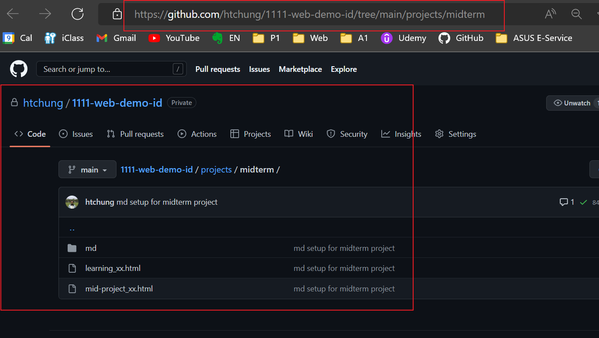
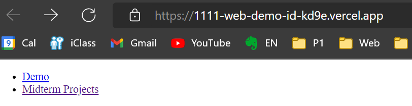
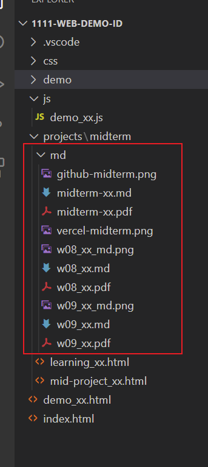
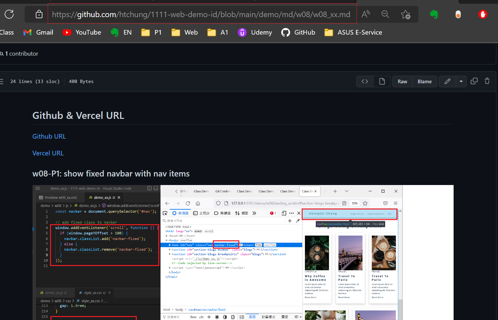
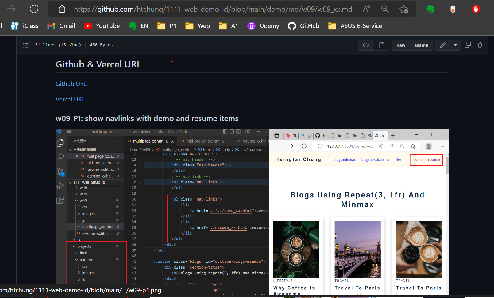

## Github & Vercel URL

[Github URL](https://github.com/htchung/1111-web-demo-id)

[Vercel URL](https://1111-web-demo-id-kd9e.vercel.app/)

[Midterm Project Github URL](https://github.com/htchung/1111-web-demo-id/tree/main/projects/midterm)



[Midterm Project Vercel URL](https://1111-web-demo-id-kd9e.vercel.app/projects/midterm/mid-project_xx.html)



### md file structure



### midterm-P1: class demo of week 8 and week 9

[Week 8 md Github URL](https://github.com/htchung/1111-web-demo-id/tree/main/demo/md/w08/w08_xx.md)



[Week 9 md Github URL](https://github.com/htchung/1111-web-demo-id/tree/main/demo/md/w09/w09_xx.md)



### midterm-P2: works

#### 加入 works 圖片及文字說明


### midterm-P3: resume

#### 加入 resume 圖片及文字說明


### midterm-P$: learning

#### 加入 learning 圖片及文字說明


### midterm-logs: all logs for midterm projects

#### 加入所有的 logs 紀錄，起始時間要自己設定


```
$ git log --pretty=format:"%h%x09%an%x09%ad%x09%s" --after="2022-10-1"

```
