## Github & Vercel URL

[Github URL](https://github.com/htchung/1111-web-demo-id)

[Vercel URL](https://1111-web-demo-id-kd9e.vercel.app/)

### w14-P1: file structures for final project

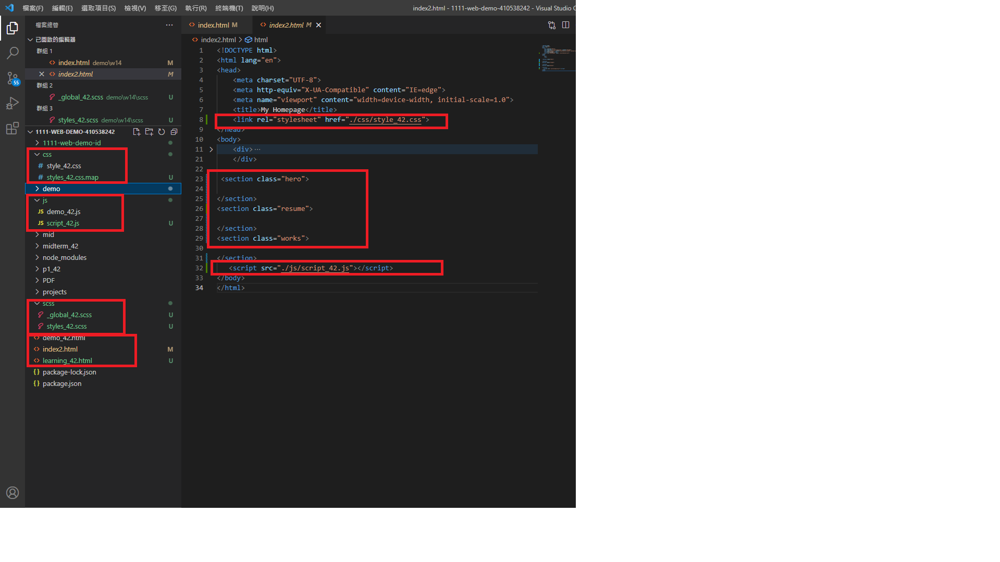

### w14-P2: social icons using global css, and custom css

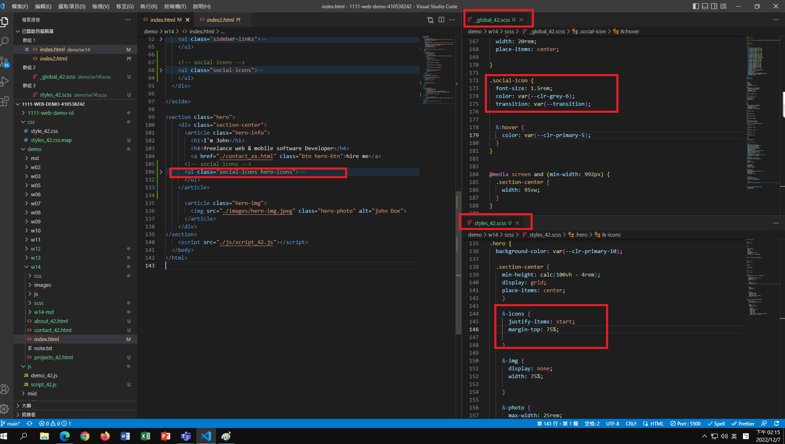

### w14-P3: Services section with responsive design with phone, pad and desktop computer
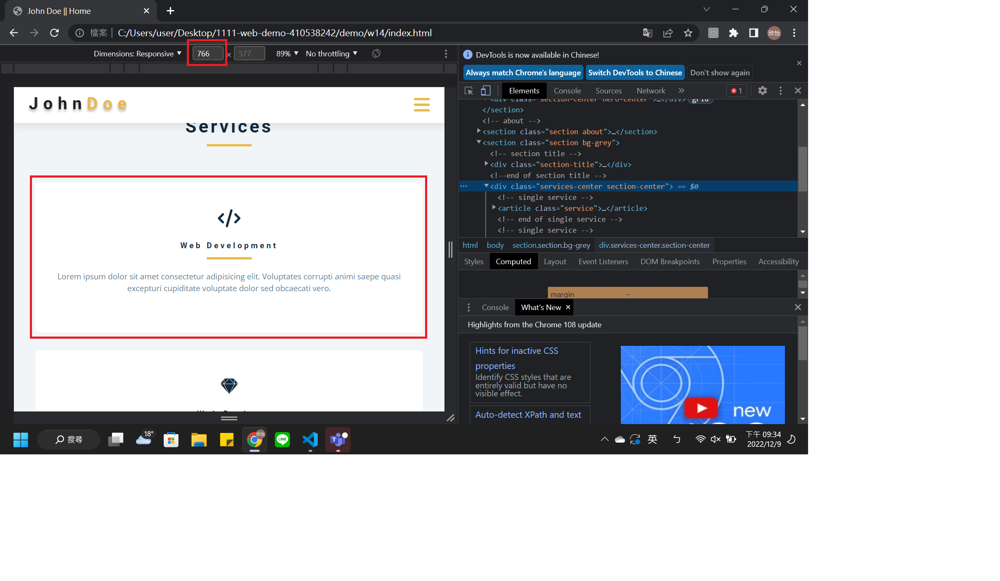
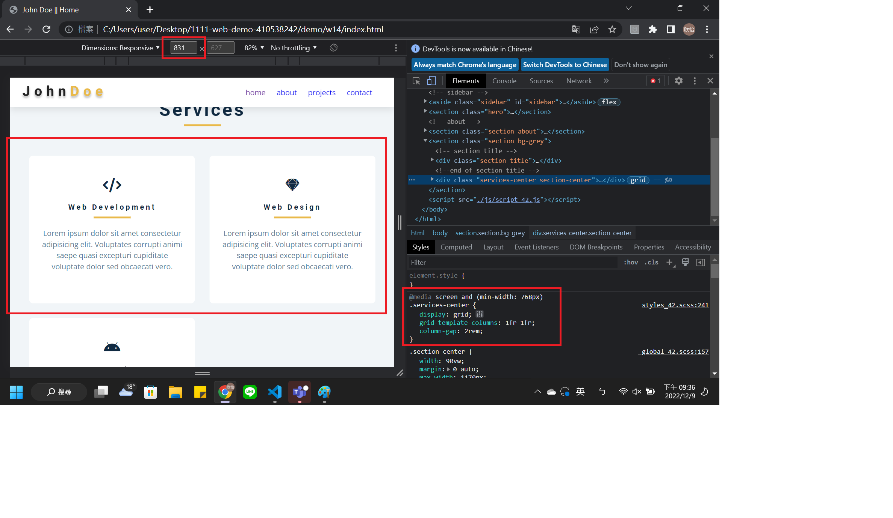
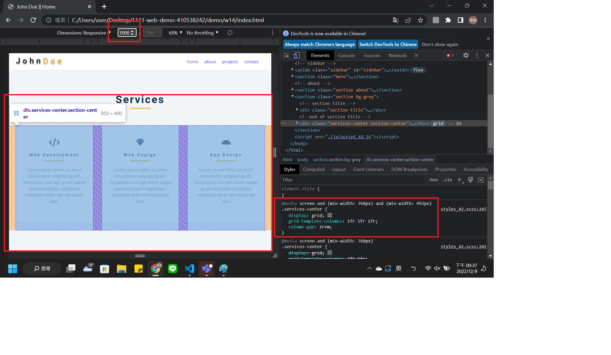

### w14-P4: finish About section with responsive design with phone, and desktop computer
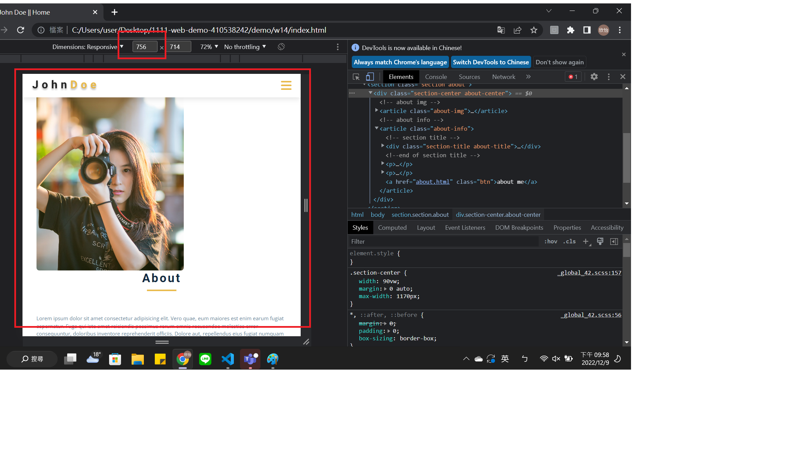
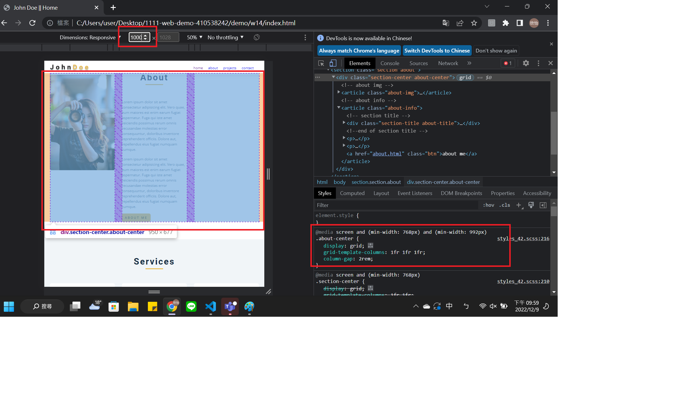

### w14 all logs
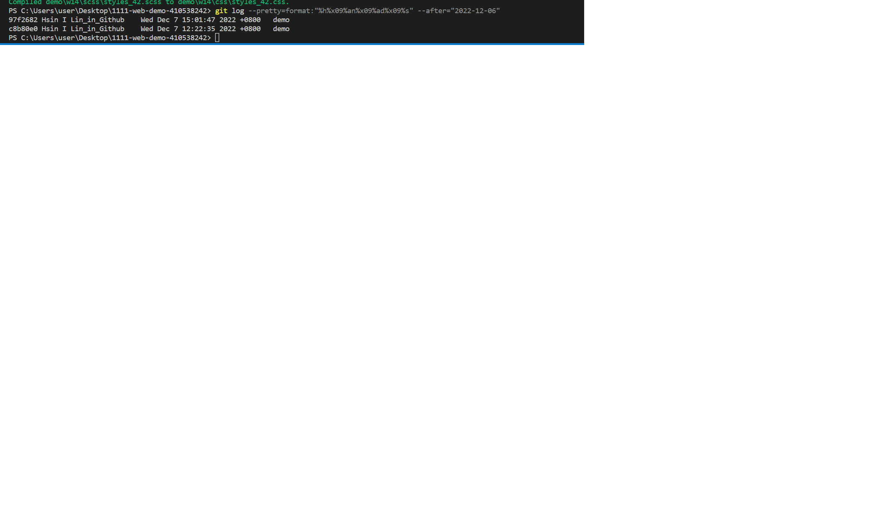
```
git log --pretty=format:"%h%x09%an%x09%ad%x09%s" --after="2022-12-06"
97f2682 Hsin I Lin_in_Github    Wed Dec 7 15:01:47 2022 +0800   demo
c8b80e0 Hsin I Lin_in_Github    Wed Dec 7 12:22:35 2022 +0800   demo
```

### w15-P1: nav link to about page with navbar and footer

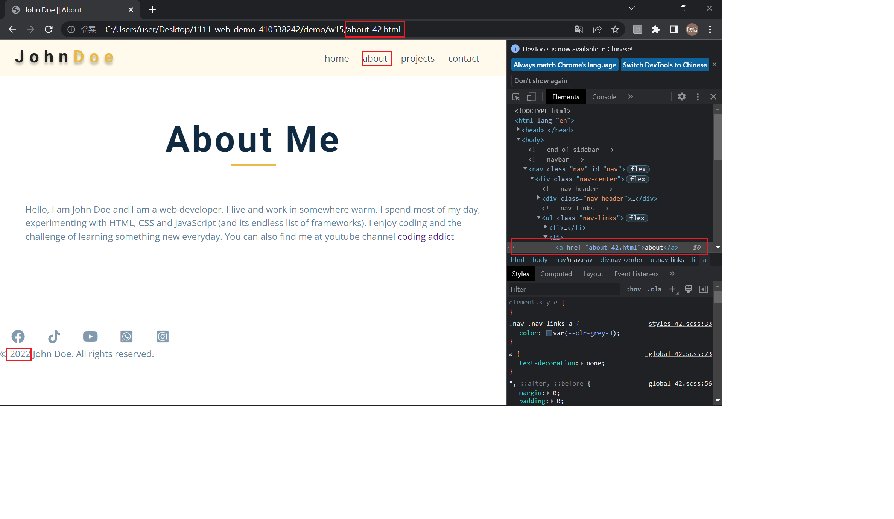
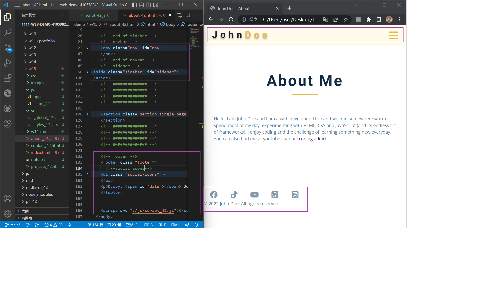

### w15-P2: Latest works using grid-template-areas
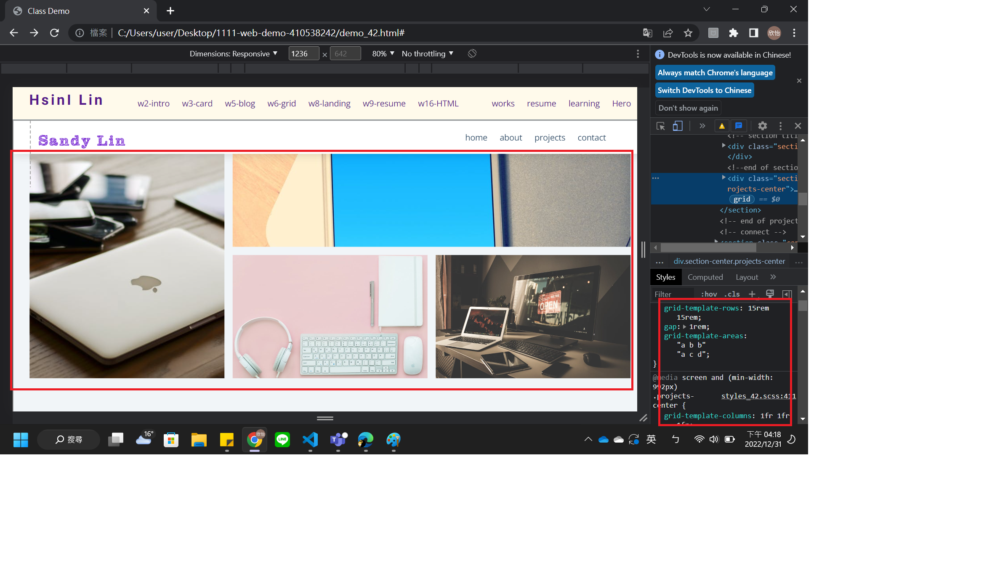
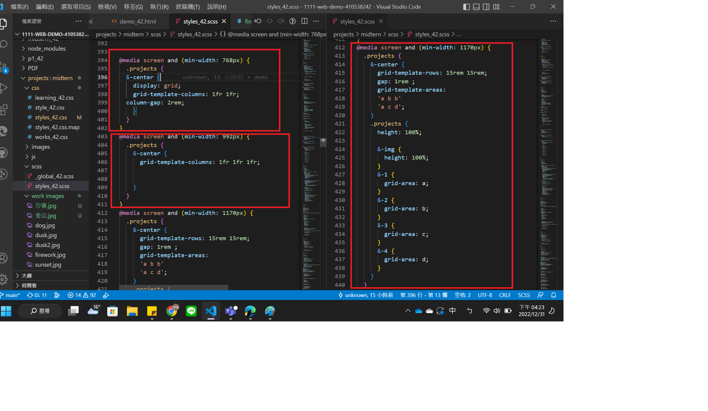
### w15 all logs
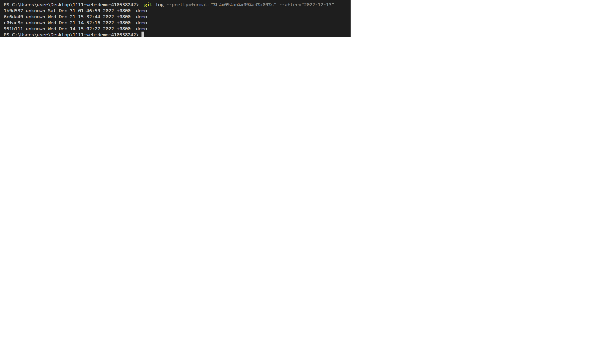
```
git log --pretty=format:"%h%x09%an%x09%ad%x09%s" --after="2022-12-13"
1b9d537 unknown Sat Dec 31 01:46:59 2022 +0800  demo
6c6da49 unknown Wed Dec 21 15:32:44 2022 +0800  demo
c0fac3c unknown Wed Dec 21 14:52:16 2022 +0800  demo
951b111 unknown Wed Dec 14 15:02:27 2022 +0800  demo
```

### w16-P1: show how to show odd number timeline
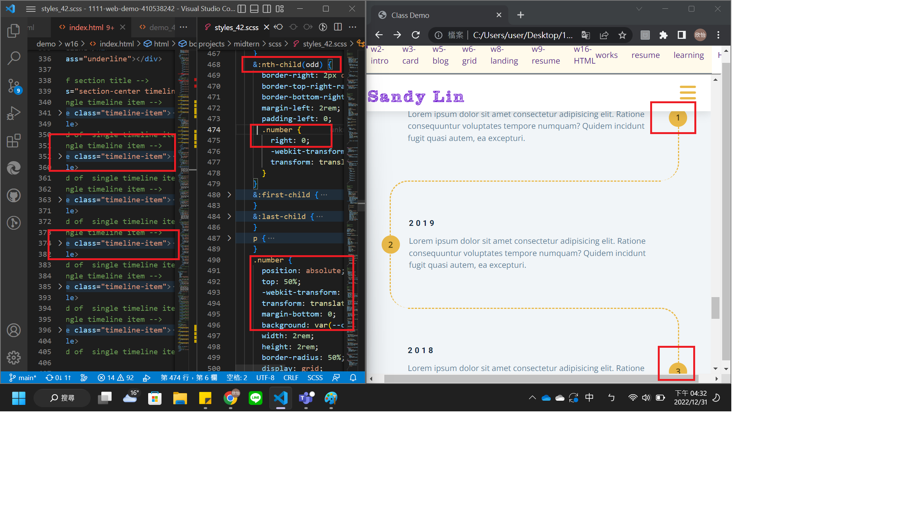
 
 ### w16-P2:connect section using clip-path
 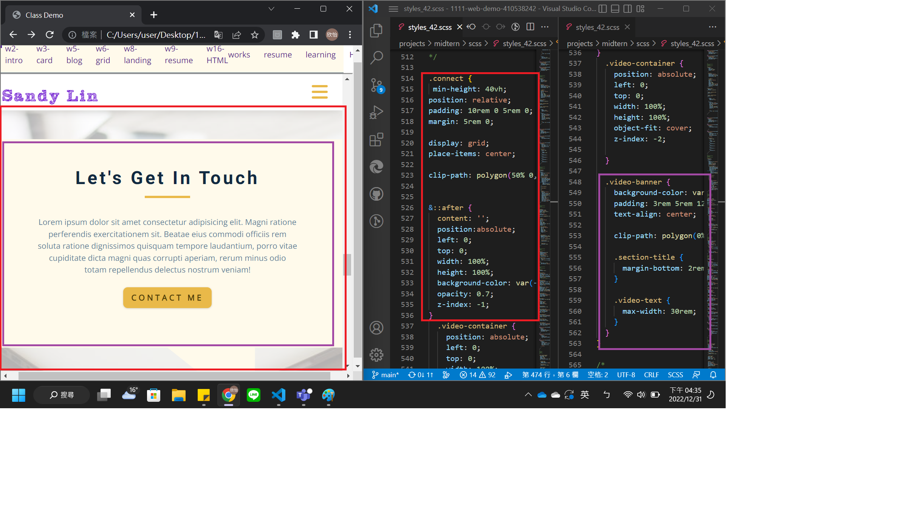

 ### w16 all logs
 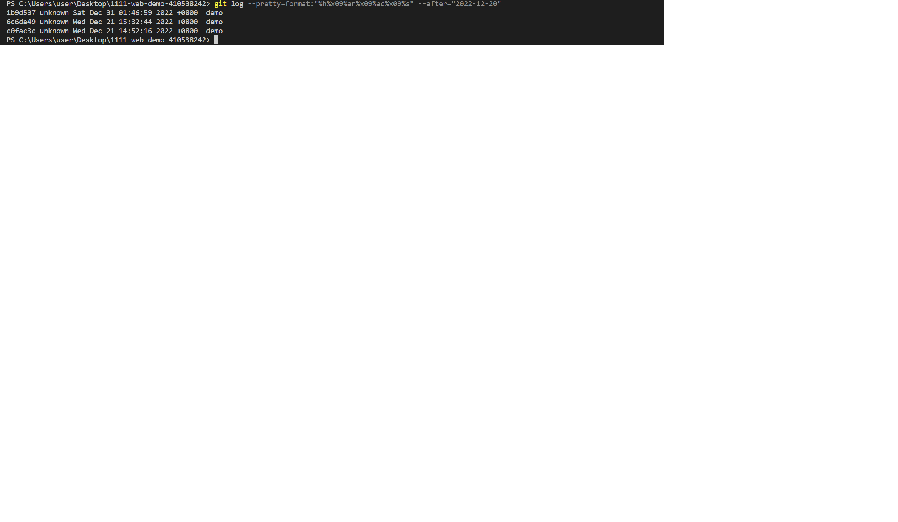
 ```
git log --pretty=format:"%h%x09%an%x09%ad%x09%s" --after="2022-12-20"
1b9d537 unknown Sat Dec 31 01:46:59 2022 +0800  demo
6c6da49 unknown Wed Dec 21 15:32:44 2022 +0800  demo
c0fac3c unknown Wed Dec 21 14:52:16 2022 +0800  demo
```